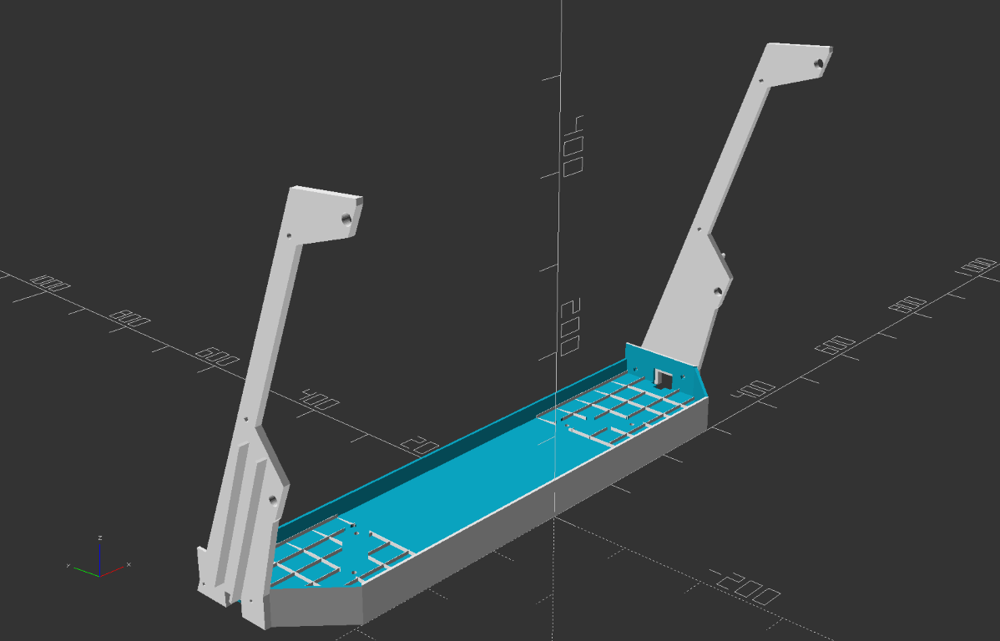
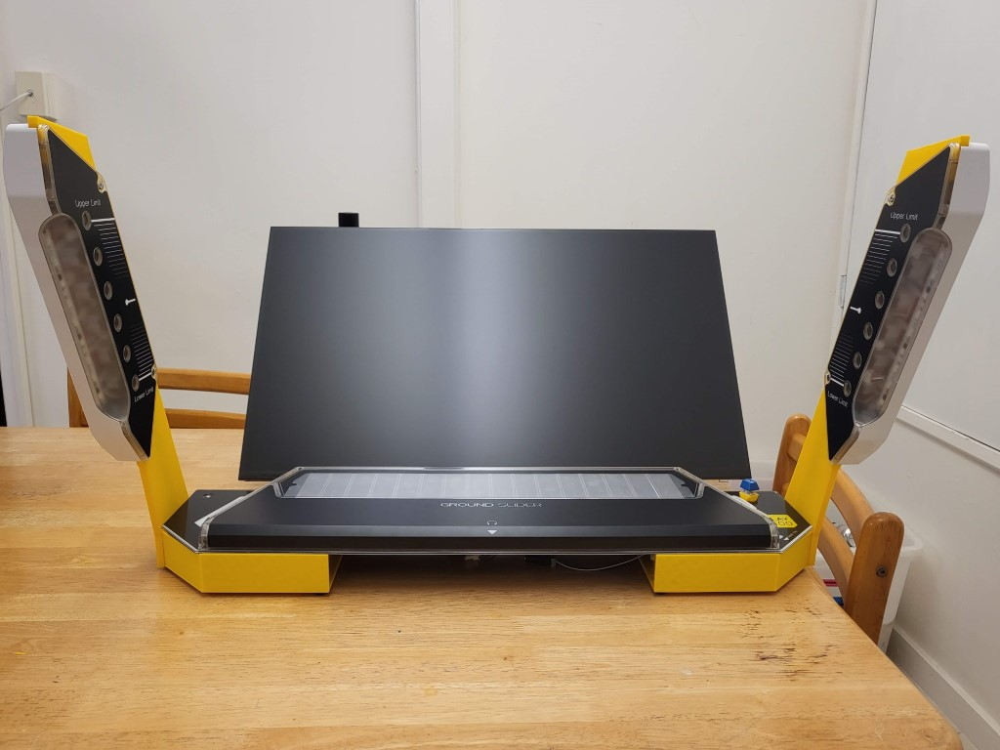
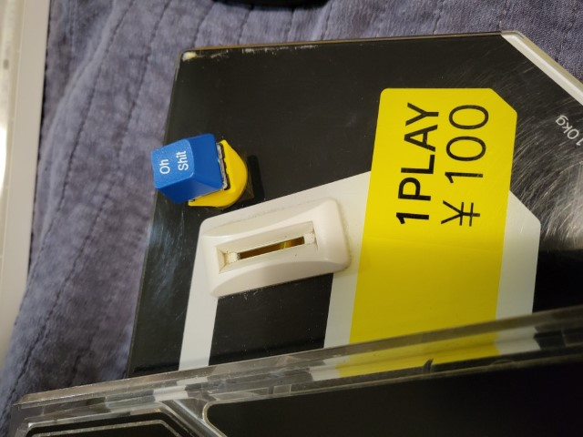

# Chunithm 3D printed case

This is a 3D printed case so your slider panel + airs you bought off Yahoo
Auctions can happily sit on a table.

## Print settings
For all pieces, I used 10% infill, no supports, 0.28mm layer height (Cura's
"Low quality" setting).

## Installation
You will need
- M4 bolt x4
- M4 washer x4
- M4 nut x4
- M5 bolt x4 (these may already exist in the black metal brackets the airs were
  originally attached to)
- Soldering iron or hot object (to press-fit M4 nuts into 3D print)
- About 600g of filament
- 8 rubber adhesive feet

Print all the pieces in the `stl` folder. Ignore `coin_return_cherry_mx` if
you're not going to use it. The `air_bottom` piece will need to be flipped in
your slicer so the flat side is on the bed. Also, mirror `air_bottom` and print
another copy for the opposite air.

Disassemble your air strings, making note of the 2 shorter bolts on the front
side. Put the printed pieces in and reinstall screws. DO NOT OVER-TIGHTEN. The
plastic of the airs may crack if you do. You might need to gently bend the wire
harness to comfortably make it into the wire channel, this is normal.

Using a soldering iron to heat the M4 nuts, carefully push them into the holes on
the case parts. You're not looking for a structural fit, it's just so
the nuts don't fall out.

Attach the rubber feet to the bottom of the case so the screws don't scratch
your table.

You can install the case first or attach the airs to the case first, I prefer
attaching the airs because routing the cable is easier.

Use the M4 bolts and washers to attach the air strings to the case.

Use the M5 bolts to attach the case to the metal bracket on the back of the
slider.

Hook up wiring (see the [wiki](https://rhythm-cons.wiki/w/Chunithm)).

## Notes
- The print is designed for a bed of 300mm, e.g. a CR10s. With some creative
  cutting, it could be fit into a 200mm bed. Feel free to submit a PR if you
  work it out.
- The print contains very large, flat sections directly on the bed. If you don't
  have a flat bed or a mesh bed level, it WILL warp. This can result in
  dimensional inaccuracy (not a huge problem really) or part detachment
  mid-print (quite a problem).
- Some of the holes are off by 0.5-1mm, but it doesn't affect installation. You
  can fix it if you're a perfectionist.

## Thanks
To Moldypie, for the original laser-cut case. The airs would have not existed
without it.

## SCAD notes
It's a mess. Made in a rush, and probably incomprehensible to anyone but me.
Mixture of constants in good places and magic numbers in other places.

Modify `op` at the bottom of the file to render different parts of the build.

Gratuitously use `#` and `%` to debug things if you're trying to extend it.

# Cherry MX adapter for coin return
Bonus!

This lets you replace the coin return button with a Cherry MX switch. Solder
leads to it and pass them through the middle.

I printed this using 0.2mm layer height and used the original nut and washer
to attach it to the metal. It was _extremely_ tight, so I recommend playing with
the tolerances in the thread library if you don't want to get out two spanners
and potentially shatter the piece.
